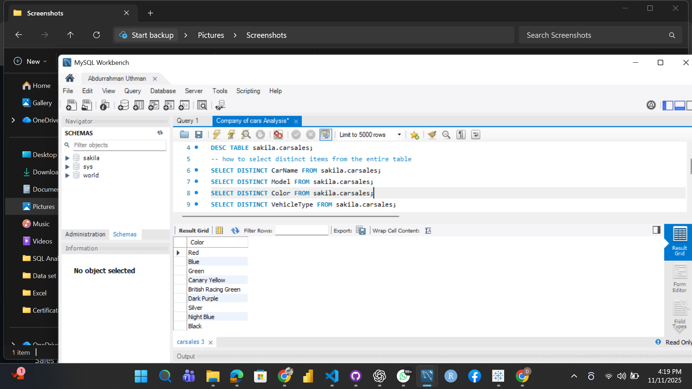

📊 Overview

This project showcases an in-depth data analysis of a BMW Cars dataset using SQL. The goal was to extract meaningful insights related to car pricing, mileage, regional sales performance, and overall profitability.

By leveraging SQL’s data manipulation and aggregation capabilities, the analysis uncovers valuable trends and patterns in BMW’s sales and product performance.

🧠 Objectives

Clean and prepare raw data for analysis.

Identify and remove duplicate records.

Analyze key performance indicators (KPIs) such as:

Average price by car model.

Average mileage by year.

Total sales and total price by region.

Fuel type distribution.

Sales and color performance.

Overall profit gain.

🧰 Tools & Technologies

SQL Language (MySQL / MariaDB)

Database: Sakila schema

Dataset: bmw cars table
📈 Insights & Findings

Model Pricing: Luxury models (e.g., X5, X7) have the highest average prices.

Mileage Trends: Newer car years show lower average mileage.

Regional Performance: Some regions contribute significantly more to total sales.

Fuel Preference: Petrol remains the most popular fuel type among buyers.

Profitability: The dataset reveals positive profit margins across multiple car models.

🧩 Skills Demonstrated

SQL Query Writing

Data Cleaning and Deduplication

Data Aggregation & Grouping

Descriptive Data Analysis

Business Intelligence Reporting

🏁 Conclusion

This analysis demonstrates how SQL can transform raw automobile data into actionable business insights. It reflects both technical skills and analytical thinking — essential for roles in data analytics, business intelligence, and decision support.

📎 Author

👤 Abdurrahman Uthman

🎓 300-Level Statistics Student
  Ahmadu Bello University.
  

